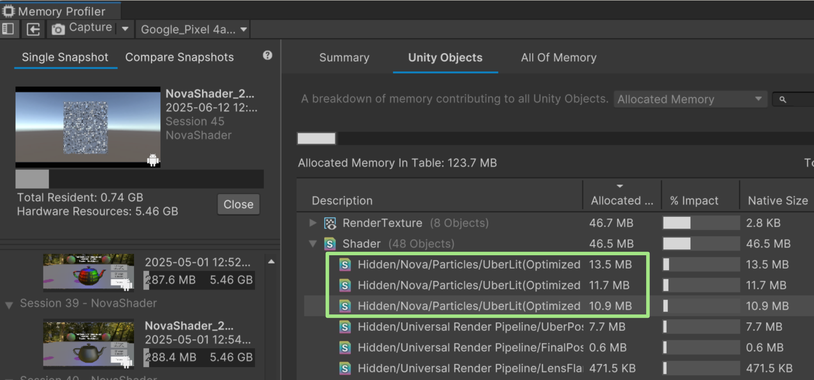

# シェーダー最適化

## 1. Uberシェーダーのメモリ使用量の問題
Uberシェーダーは下記のような理由からメモリ使用量が膨れ上がることがあります。
- 不要なシェーダーパスが残ってしまう
- 不要なシェーダーキーワードが残ってしまう

次の画像は`Assets/Demo/Demo_OptimizedShaders/Demo_OptimizedShader`シーンを実機ビルドした際のメモリ使用量です。


`Demo_OptimizedShader`シーンはエディタスクリプトで大量のシェーダーバリアントを自動生成しているので、極端な例はありますが、実際のプロジェクトでこのようにNova Shaderのメモリ使用量が膨れ上がっているケースはありました。

膨れ上がる要因はシェーダーバリアントの増加なのですが、Uberシェーダーであるがゆえに、プロジェクトによっては必要ないパスやキーワードまで含まれてしまっていて、シェーダーバリアントが膨れ上がっています。


### 1.1 不要なシェーダーパスが残ってしまう
Uberシェーダーで問題になっているのは下記の3つのパスです。
- Shadow Casterパス
- Depth Onlyパス
- Depth Normalsパス

これらのパスはケースによって不要な場合があります。

#### ケース1. Depth Onlyパス、Depth Normalsパスが不要
`Depth OnlyパスとDepth NormalsパスはDepth Prepassが有効になっていない` かつ `Renderer PassでDepth Onlyパス or Depth Normalsパスが要求されていない`場合は不要なパスです。
しかし、このパスの有無はプログラム実行時まで分からないため、不要であってもビルド時にストリップされません。そのため、Uberシェーダーではこのパスが残ったままになってしまいます。

#### ケース2. 半透明エフェクトに深度値書き込みが不要
これもプロジェクトの要件次第ですが、半透明エフェクトはそもそも深度値書き込みを行わないというケースがあると思います。しかし、UnityにはRender Typeによってパスを削除するという機能はないため、これも無駄になってしまいます。
```
Material.SetShaderPassEnabledを利用してパスの有効/無効を切り替えることはできるが、マテリアル単位でのシェーダーの有効/無効を切り替えるだけなので、大元のシェーダーのメモリ使用量を変えることはできない
```

#### ケース3. エフェクトの影は落とさない
最後にエフェクトの影はキャストしないというケースもあると思います。これについてもキャストしない場合でも`Shader Caster`パスが残ってしまうため、無駄なシェーダーバリアントを生み出します。


### 1.2 不要なシェーダーキーワードが残ってしまう
先ほどの話は不要なパスでしたが、不要なキーワードが残ってしまうケースがあります。
例えば、`Opaque`の描画のDepth Onlyパスに下記のようなシェーダーキーワードがある場合を考えます。

```cpp
#pragma shader_feature_local _BASE_MAP_MODE_2D _BASE_MAP_MODE_2D_ARRAY _BASE_MAP_MODE_3D
```
これらのキーワードはベースマップに関するキーワードなのですが、深度値書き込みの時にカラーを計算する必要はないので、`Opaque`の描画であれば本来不要なキーワードです。しかし、`Transparent`や`Cutout`の深度値を書き込むときはテクスチャのα値が必要がなので、αに関連するキーワードを残しておく必要があります。
そのため、`Render Type`が`Opaque`の場合は本来必要ないキーワードなのですが、これも残ってしまっています。

### 1.3 Unityへのヒアリング
これらの問題の解決について、Unityにもヒアリングをした結果、Nova ShaderのようなUberシェーダーで、`Render Type`に応じて特定のパスを削除するといったことは難しく、専用の最適化されたシェーダーを生成するということがベストプラクティスであるという回答を頂きました。

### 1.4 最適化API

Unityの回答を得て、Nova Shaderに不要なパスをストリップできる最適化シェーダーの自動生成機能を実装しました。この機能を使って、`Assets/Demo/Demo_OptimizedShaders/Demo_OptimizedShader`シーンをビルドしたした時のNova Shaderのメモリ使用量は次のようになります。



最適化前と比較するとメモリ使用量は`72.2MB`->`36.1MB`となっていて、50%削減できています。


## 2. ワークショップ

では、Nova Shaderの最適化APIを利用するワークを行っていきます。

`Assets/Demo/Demo_OptimizedShader/Editor/Sample.cs`を開いてください
### step-1 最適化シェーダーを生成する

まずは、最適化シェーダーを生成します。
該当するコメントの箇所に`リスト1`のコードを入力してください。<br/>

[リスト1]
```cs
// step-1 最適化シェーダーを生成する
// 最適化シェーダーの生成
OptimizedShaderGenerator.Generate(
    "Assets/Demo/Demo_OptimizedShader/OptimizedShaders"
);

```

入力できたら Tools -> Demo -> Generate Optimized Shaderを実行してください。実行できたら次の図のように、`Assets/Demo/Demo_OptimizedShaders/OptimizedShaders`の中に生成されたシェーダーが格納されています。<br/>


### step-2 最適化シェーダーに置き換える
続いて、Uberシェーダーが割り当てられているマテリアルに、先ほど生成した最適化シェーダーを割り当てていきます。<br/>
今回はRender Typeごとに下記のようなオプショナルパスを利用するように設定しています。
|Render Type|使用するオプショナルパス|
|---|---|
|Opaque | Shadwo Caster、DeptyOnly |
|Cutout | Shadwo Caster、DeptyOnly |
|Transparent |なし|

各Render Typeの描画で必要なパスはプロジェクトの状況によって変わるため、プロジェクトのグラフィックスエンジニアの方にご相談ください。

また、全てのマテリアルを差し替え対象としていますが、OptimizedShaderReplacer.Settings.TargetFolderPathに差し替え対象のマテリアルのルートフォルダを指定することも可能です。そのため、マテリアルごとに細かいコントロールも可能です。<br/>
では、該当するコメントの箇所に`リスト2`のコードを入力してください。<br/>

入力できたら`Assets/Demo/Demo_OptimizedShader/Materials`の中のマテリアルに割り当てられているシェーダーを確認してみて下さい。

[リスト2]
```cs
// step-2 最適化シェーダーに置き換える
// マテリアルのシェーダーの差し替え
var replaceSettings = new OptimizedShaderReplacer.Settings
{
    OpaqueRequiredPasses = OptionalShaderPass.ShadowCaster | OptionalShaderPass.DepthOnly,
    CutoutRequiredPasses = OptionalShaderPass.ShadowCaster | OptionalShaderPass.DepthOnly,
    TransparentRequiredPasses = OptionalShaderPass.None
};
OptimizedShaderReplacer.Replace(replaceSettings);
```

### step-3 ビルド時に最適化シェーダーを自動生成/置き換え
では、最後にstep-1とstep-2の抱き合わせでビルド時に最適化シェーダーを生成して置き換えを行っていきましょう。
該当するコメントの箇所に`リスト3`のコードを入力してください。

[リスト3]
```cs
// 最適化シェーダーの生成
OptimizedShaderGenerator.Generate(
    "Assets/Demo/Demo_OptimizedShader/OptimizedShaders"
);
// マテリアルのシェーダーの差し替え
var replaceSettings = new OptimizedShaderReplacer.Settings
{
    OpaqueRequiredPasses = OptionalShaderPass.ShadowCaster | OptionalShaderPass.DepthOnly,
    CutoutRequiredPasses = OptionalShaderPass.ShadowCaster | OptionalShaderPass.DepthOnly,
    TransparentRequiredPasses = OptionalShaderPass.None
};
OptimizedShaderReplacer.Replace(replaceSettings);
```
入力できたら`Tools->Custom Build With Shader Optimize`を実行してビルドしてみてください。

## 参照

- ドキュメント
  - [最適化シェーダーの利用によるメモリ使用量の削減のドキュメント](https://github.com/CyberAgentGameEntertainment/NovaShader/blob/main/README_JA.md#%E6%9C%80%E9%81%A9%E5%8C%96%E3%82%B7%E3%82%A7%E3%83%BC%E3%83%80%E3%83%BC%E3%81%AE%E5%88%A9%E7%94%A8%E3%81%AB%E3%82%88%E3%82%8B%E3%83%A1%E3%83%A2%E3%83%AA%E4%BD%BF%E7%94%A8%E9%87%8F%E3%81%AE%E5%89%8A%E6%B8%9B)
- 最適化APIのリファレンス
  - [OptimizedShaderGenerator](https://github.com/CyberAgentGameEntertainment/NovaShader/blob/main/Documentation~/OptimizedShaderGenerator_JA.md)
  - [OptimizedShaderReplacer](https://github.com/CyberAgentGameEntertainment/NovaShader/blob/main/Documentation~/OptimizedShaderGenerator_JA.md)
- サンプルコード
  - [ShaderOptimizeSample.cs](https://github.com/CyberAgentGameEntertainment/NovaShader/blob/main/Assets/Samples/Editor/ShaderOptimizeSample.cs)
